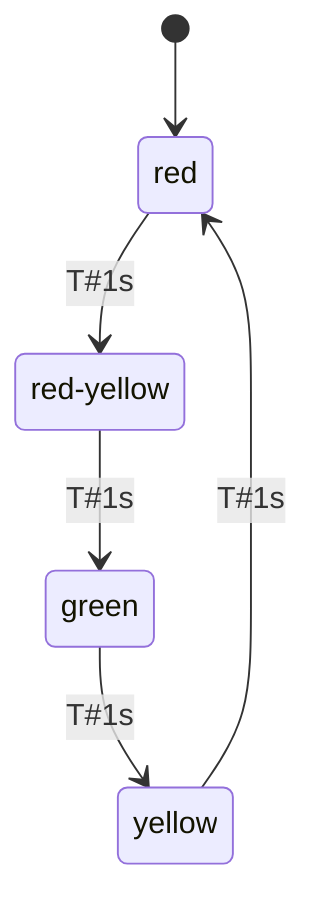
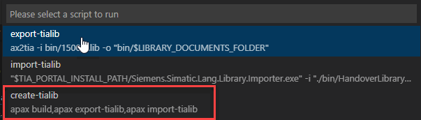
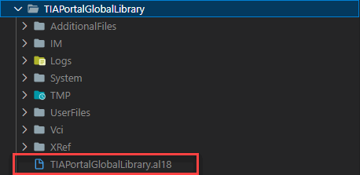

# Application Example for TIAX use case

## TIAX use case

The TIAX use case is a workflow, which converts a library written in ST and SIMATIC AX to TIA Portal global library for TIA Portal > V18

## What shows the application example

This application example shows two different use cases:

1. Traffic light
1. JSON serializer

## Traffic light

This simple Trafficlight example is solved with a state pattern of the `@simatic-ax/statemachine` library. This traffic light shows the the phases of a german traffic light (`red` --> `red-yellow` --> `green` --> `yellow` --> `red` and so on). Each phase will be active for one second.



### How a state will be created

Each state is realized as a own class which is extended from `State1Transition`

Example:

```iec-st
CLASS StateRed EXTENDS State1Transition
    VAR
        count : LINT;
        activations : LINT;
    END_VAR
    VAR PUBLIC 
        rd : REF_TO BOOL;
    END_VAR
    METHOD PUBLIC OVERRIDE OnEntry
        activations := activations + 1;
        rd^ := TRUE;
    END_METHOD
    METHOD PUBLIC OVERRIDE Action
        count := count + 1;
    END_METHOD
    METHOD PUBLIC OVERRIDE OnExit
        rd^ := FALSE;
    END_METHOD
    METHOD PUBLIC GetColor : Colors
        GetColor := Colors#Red;
    END_METHOD
END_CLASS
```

In this example, the methods `OnEntry`, `OnExit` and `OnAction` of the class `StateRed` will be overridden with our own code. So we can decide, what happens, when the state will be activated. In this case, we count the number of activations and switch the red will be set to true (which means, the red lamp will be switched on)

### Transition of the states

This happens in the `TrafficlightWrapper`. This wrapper has internally the instances of all states. Additionally, the each state needs a Transition of type `ITransition` - in this example jsut of the Type `Transition` which has implemented the interface `ITransition`.

The Transition is responsible, to switch from the one state to the next state. That means, the transition need to know, the `NextState` of type `IState` and the condition of type `IGuard`, when the transition is fulfilled. In this case, the `Check()` method of a `Guard` returns `true`.

In our example we use a `TimeoutGuard` wich returns `true` after a configured time is elapsed.

In Our example, you'll find the instances of the states, transitions and the TimeoutGuard.

```iec-st
VAR
    _stateRed : StateRed;
    _stateRedTrans : Transition;
    _TimeoutGuard : TimeoutGuard;
    _stateRedYellow : StateRedYellow;
    _stateRedYellowTrans : Transition;
    _stateGreen : StateGreen;
    _stateGreenTrans : Transition;
    _stateYellow : StateYellow;
    _stateYellowTrans : Transition;
    init : BOOL;
END_VAR
```

### State controller

In order for the state machine to work in the end, we also need a StateController. This only needs the initial state.

```iec-st
VAR
    _sc : StateController;
END_VAR
```

### Configure the statemachine

Since it is currently not possible, to use initializers for references and also not possible to use initial values in the TIAX use case, we need to define a init routine in our wrapper which is called once.

```iec-st
IF NOT init THEN
    // Congfigure StateController
    _sc.InitialState := _stateRed;
    _TimeoutGuard.Timeout := T#1000ms;
    // Configure Red
    _stateRed.Transition1 := _stateRedTrans;
    _stateRed.StateID := 1;
    _stateRedTrans.NextState := _stateRedYellow;
    _stateRedTrans.Guard := _TimeoutGuard;
    _stateRed.rd := REF(rd);
    // ...
    init := TRUE;
END_IF;
```

In ths init routine, we parametrize our state machine.

1. Set the initial state to `_stateRed`

    Example:

    ```iec-st
    _sc.InitialState := _stateRed;
    ```

1. Set the `Timeout` parameter for the `TimeoutGuard` to 1000ms;

    Example:

    ```iec-st
    _TimeoutGuard.Timeout := T#1000ms;
    ```

1. Configure the Transitions for each state

    Example:

    ```iec-st
    _stateRedTrans.NextState := _stateRedYellow;
    _stateRedTrans.Guard := _TimeoutGuard;
    ```

1. Configure all states:

    Example for state red:

    ```iec-st
    _stateRed.Transition1 := _stateRedTrans;
    _stateRed.StateID := 1;
    ```

### Run the state controller

That the state machine runs, the cyclic method `Execute()` must be called in the Wrapper.

```iec-st
_sc.Execute();
```

Now our traffic light is complete and can be imported in a TIA Portal global library. [Chapter `Steps to create the TIA Portal Global Library` describes how this works](#steps-to-create-the-tia-portal-global-library)

<!-- ## JsonSerializer

The function block `JsonStructure` has as input parameter: `DeviceName : STRING`, `IP : STRING`, `Timeout : INT`, `AutoConnect : BOOL`. On the rising edge of the `Execute` signal the input parameters will be read and converted to into a Json structure.

Example:

```json
{"DeviceName": "Device1", "Parameter": {"IP": "192.168.0.1", "Timeout": 300, "AutoConnect": true}}
``` -->

## Steps to create the TIA Portal Global Library

Before we can create the TIA Portal global library, please check, if the `TIA_PORTAL_INSTALL_PATH` in the `.env` file points to your TIA Portal installation.

Adapt the version of the TIA Portal global library in the file `apax.yml`

```yml
name: "@simatic-ax/ae-tiax"
version: 0.0.1
type: lib
```

> for the first run, it can be kept at 0.0.1. If you create it a second time, please mind, that the same version must not exist in the gloabal library.

### Crate library via command line

When it's ok, just call the apax script `create-tialib` via command line

```bash
apax create-tialib
```

wait until the import process is finished


### Crate library via UI

1. click on
    

1. select
    

1. wait until the import process is finished


### Location of the Global Library 

The generated global library you'll find in the following folder:



If you want to adapt the name of the library (and output directory), you can modify the apax.yml

```yml
variables:
  GLOBAL_LIBRARY_PATH: "TIAPortalGlobalLibrary"
```