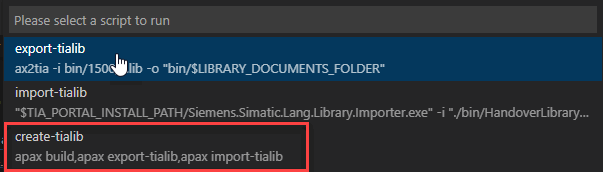
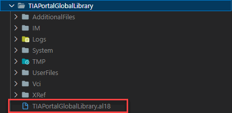

# Collection of application examples for TIAX use cases

## TIAX use case

The TIAX use case is a workflow, which converts a library written in ST and SIMATIC AX to TIA Portal global library for TIA Portal > V18

## Which examples can you find in ths application example

This application example shows two different use cases. To read the description of the use cases, just follow the link below.

1. [Traffic light](./docs/TrafficLight.md) : A traffic light which is realized with the [statemachine](https://github.com/simatic-ax/statemachine) library.
1. JSON serializer (in work) : A JSON structure created with the usage of the [JSON](https://github.com/simatic-ax/json) library can be filled with parameters and serialized to an ARRAY OF CHAR.
1. Further ideas? Just create an [issue](https://github.com/simatic-ax/ae-tiax/issues/new?assignees=&labels=&template=feature_request.md&title=) or even better a `pull request`.

## How to install the application example?

      Run the following commands in a CLI
      ```sh
      apax create @simatic-ax/ae-trafficlight --registry https://npm.pkg.github.com ae-tiax
      axcode ae-tiax 
      ```

## How to generate a TIA Portal global library

Before we can create the TIA Portal global library, please check, if the `TIA_PORTAL_INSTALL_PATH` in the `.env` file points to your TIA Portal installation.

### Steps to create a TIA Portal global library

1. Compile the ST code with `apax build`
1. Export the compiled library into HandoverFiles with `ax2tia...`
1. Import the HandoverFiles with the TIA Portal `Importer.exe`

That can be done manually step by step. Or you can use the predefined scripts in the apax.yml

1. The scripts in the apax.yml

    To make the creation of the library easier, in the apax yml are some scripts predefined:

    ```yml
    scripts:
      export-tialib: ax2tia -i bin/1500/*.lib -o "bin/$LIBRARY_DOCUMENTS_FOLDER"
      import-tialib: '"$TIA_PORTAL_INSTALL_PATH/Siemens.Simatic.Lang.Library.Importer.exe"
        -i "./bin/HandoverLibraryDocuments" -o "./$GLOBAL_LIBRARY_PATH" -u'
      create-tialib:
        - apax build
        - apax export-tialib
        - apax import-tialib
    ```

    - `export-tialib` : generates the HandoverFiles
    - `import-tialib` : Import the HandoverFiles and creates the TIA Portal global library
    - `create-tialib` : Executes the steps: build, export, import

1. Set the library version

    Adapt the version of the TIA Portal global library in the file `apax.yml`

    ```yml
    name: "@simatic-ax/ae-tiax"
    version: 0.0.1
    type: lib
    ```

    > for the first run, it can be kept at 0.0.1. If you create it a second time, please mind, that the same version must not exist in the gloabal library.

1. Create the TIA Portal global library

    - via command line

      1. just call the apax script `create-tialib` via command line

          ```bash
          apax create-tialib
          ```

      1. wait until the import process is finished

          

    - via user interface

      1. click on

          

      1. select

          

      1. wait until the import process is finished

1. Find the imported TIA Portal Global Library

    The generated global library you'll find in the following folder:

    

    > If you want to adapt the name of the library (and output directory), you can modify the apax.yml
>
    >```yml
    >variables:
    >  GLOBAL_LIBRARY_PATH: "TIAPortalGlobalLibrary"
    >```

    This library can now opened in TIA Portal >= V18

## Contribution

Thanks for your interest in contributing. Anybody is free to report bugs, unclear documentation, and other problems regarding this repository in the Issues section or, even better, is free to propose any changes to this repository using Merge Requests.

## License and Legal information

Please read the [Legal information](LICENSE.md)
