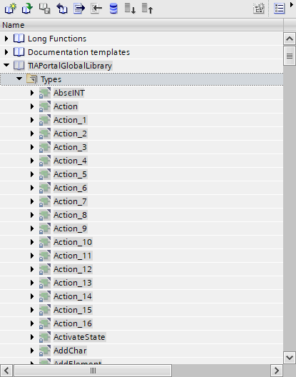

# Example library for TIAX use case

## Description

This sample library contains suitable functionalities for determining the parking space occupancy of a car park. 

## Software blocks

### Counter

Generic `Counter` class for counting upwards and downwards.

### ParkingCounter

Class `ParkingCounter` counts the filling level of the car park depending on the above described sensor signal sequence.

This class has two input sensors:
- BSensorInside
- BSensorOutside

Depending in which order the signals are occupied, the counter-value will be incremented or decremented.

Example for entering the car park:
First will the SensorOutside occupied and then SensorInside. In this case, the counter will be increased by one. 

### ParkingCounterFB

TIA Portal compatible `ParkingCounterFB` which acts as wrapper `function block`. It uses internally the class `ParkingCounter`

_Maybe a link what a wrapper FB is ?_ 
_How does a wrapper work? Also link to explanation_

## Create Global Library for the TrafficLightWrapper

Now our traffic light is complete and can be imported in a TIA Portal global library --> [How to crate a global library](./../README.md)

## Use TrafficLightWrapper in TIA Portal

1. Open a TIA Portal project, which contains any 1500 PLC

1. Open the `TIAPortalGlobalLibrary`

    

1. Select the function block `ParkingCounterWrapper` 

    

1. Instantiate the `ParkingCounterWrapper` in e.g. the Main OB

## Used features in this application example

### ST features
- Namespaces
- Enumeration
- Class & Methods 
- Call of private methods (THIS-Operator)
- Definition and implementation of interfaces (INTERFACE/IMPLEMENTS)
- Access modifier (PRIVATE/PUBLIC)

### UnitTesting
- Test fixture
- Test method
- Assertions

