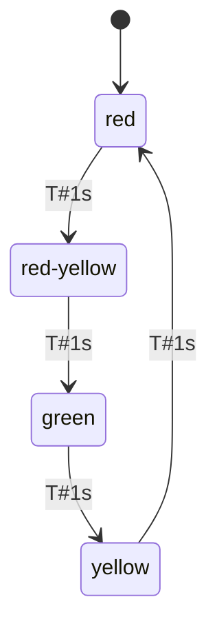
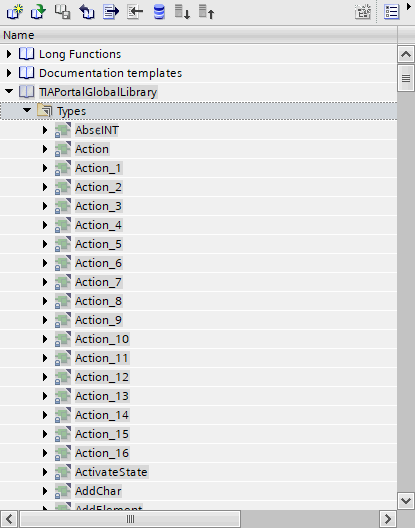
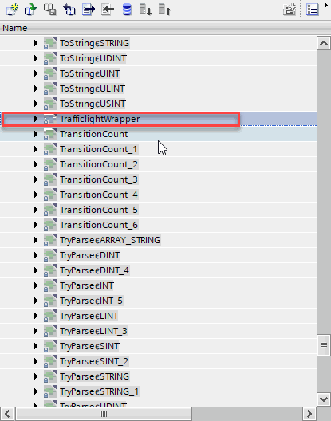
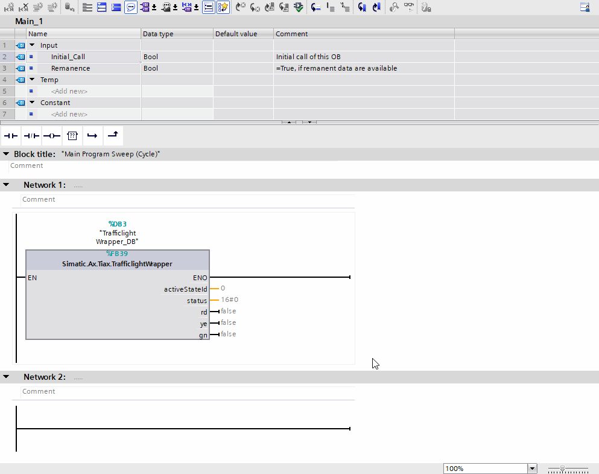
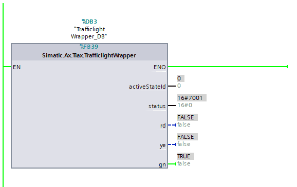

# Traffic light

This simple Trafficlight example is solved with a state pattern of the `@simatic-ax/statemachine` library. This traffic light shows the the phases of a german traffic light (`red` --> `red-yellow` --> `green` --> `yellow` --> `red` and so on). Each phase will be active for one second.



## How a state will be created

Each state is realized as a own class which is extended from `State1Transition`

Example:

```iec-st
CLASS StateRed EXTENDS State1Transition
    VAR
        count : LINT;
        activations : LINT;
    END_VAR
    VAR PUBLIC 
        rd : REF_TO BOOL;
    END_VAR
    METHOD PUBLIC OVERRIDE OnEntry
        activations := activations + 1;
        rd^ := TRUE;
    END_METHOD
    METHOD PUBLIC OVERRIDE Action
        count := count + 1;
    END_METHOD
    METHOD PUBLIC OVERRIDE OnExit
        rd^ := FALSE;
    END_METHOD
    METHOD PUBLIC GetColor : Colors
        GetColor := Colors#Red;
    END_METHOD
END_CLASS
```

In this example, the methods `OnEntry`, `OnExit` and `OnAction` of the class `StateRed` will be overridden with our own code. So we can decide, what happens, when the state will be activated. In this case, we count the number of activations and switch the red will be set to true (which means, the red lamp will be switched on)

## Transition of the states

This happens in the `TrafficlightWrapper`. This wrapper has internally the instances of all states. Additionally, the each state needs a Transition of type `ITransition` - in this example jsut of the Type `Transition` which has implemented the interface `ITransition`.

The Transition is responsible, to switch from the one state to the next state. That means, the transition need to know, the `NextState` of type `IState` and the condition of type `IGuard`, when the transition is fulfilled. In this case, the `Check()` method of a `Guard` returns `true`.

In our example we use a `TimeoutGuard` wich returns `true` after a configured time is elapsed.

In Our example, you'll find the instances of the states, transitions and the TimeoutGuard.

```iec-st
VAR
    _stateRed : StateRed;
    _stateRedTrans : Transition;
    _TimeoutGuard : TimeoutGuard;
    _stateRedYellow : StateRedYellow;
    _stateRedYellowTrans : Transition;
    _stateGreen : StateGreen;
    _stateGreenTrans : Transition;
    _stateYellow : StateYellow;
    _stateYellowTrans : Transition;
    init : BOOL;
END_VAR
```

## State controller

In order for the state machine to work in the end, we also need a StateController. This only needs the initial state.

```iec-st
VAR
    _sc : StateController;
END_VAR
```

## Configure the statemachine

Since it is currently not possible, to use initializers for references and also not possible to use initial values in the TIAX use case, we need to define a init routine in our wrapper which is called once.

```iec-st
IF NOT init THEN
    // Congfigure StateController
    _sc.InitialState := _stateRed;
    _TimeoutGuard.Timeout := T#1000ms;
    // Configure Red
    _stateRed.Transition1 := _stateRedTrans;
    _stateRed.StateID := 1;
    _stateRedTrans.NextState := _stateRedYellow;
    _stateRedTrans.Guard := _TimeoutGuard;
    _stateRed.rd := REF(rd);
    // ...
    init := TRUE;
END_IF;
```

In ths init routine, we parametrize our state machine.

1. Set the initial state to `_stateRed`

    Example:

    ```iec-st
    _sc.InitialState := _stateRed;
    ```

1. Set the `Timeout` parameter for the `TimeoutGuard` to 1000ms;

    Example:

    ```iec-st
    _TimeoutGuard.Timeout := T#1000ms;
    ```

1. Configure the Transitions for each state

    Example:

    ```iec-st
    _stateRedTrans.NextState := _stateRedYellow;
    _stateRedTrans.Guard := _TimeoutGuard;
    ```

1. Configure all states:

    Example for state red:

    ```iec-st
    _stateRed.Transition1 := _stateRedTrans;
    _stateRed.StateID := 1;
    ```

## Run the state controller

That the state machine runs, the cyclic method `Execute()` must be called in the Wrapper.

```iec-st
_sc.Execute();
```

## Create Global Library for the TrafficLightWrapper

Now our traffic light is complete and can be imported in a TIA Portal global library --> [How to crate a global library](./../README.md)

## Use TrafficLightWrapper in TIA Portal

1. Open a TIA Portal project, which contains any 1500 PLC

1. Open the `TIAPortalGlobalLibrary`

    

1. Select the function block

    

1. Instantiate the TrafficLightWrapper in e.g. the Main OB

    

1. Download the program to a PLC/PLCSIM Advanced and monitor the Main OB

   
